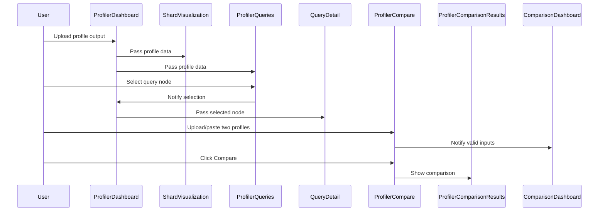

# Query Profiler Dashboard – Design Document

---

## Overview

The Query Profiler Dashboard is a React-based application for visualizing and comparing Opensearch query profile outputs. It provides two main interfaces:
- **Main Dashboard:** For uploading, exploring, and analyzing a single profile.
- **Comparison Dashboard:** For comparing two profiles side by side.

---

## Main Dashboard (Central interface for visualizing profile outputs)

**Purpose:**  
To allow users to upload a query profile, visualize shard and query profile output, and drill down into detailed metrics for each query or aggregation.

**Visual Layout:**

**Key Features:**
- Upload and validate profile files (JSON)
- Visualize shard performance
- Explore query/aggregation hierarchy
- View detailed metrics for selected queries

---

## Comparison Dashboard (Central interface for comparing profile outputs)

**Purpose:**  
To allow users to upload or paste two profiles and view a side-by-side comparison of their structure and performance.

**Visual Layout:**

**Key Features:**
- Upload or paste two profiles for comparison
- Validate both profiles
- View differences in query structure and output differences

---

## Component/Class Responsibilities

- **ProfilerDashboard:** Orchestrates the main dashboard, manages state, and renders all subcomponents.
- **ShardVisualization:** Renders shard performance and allows selection.
- **ProfilerQueries:** Displays the query/aggregation hierarchy as a tree.
- **QueryDetail:** Shows detailed metrics for the selected query/aggregation.
- **ProfilerCompare:** Handles input and validation for two profiles in comparison mode.
- **ProfilerComparisonResults:** Renders the results of the profile comparison.

---

## User Flow

1. **Main Dashboard:**
   - User uploads a profile output.
   - Shard visualization and query hierarchy are populated.
   - User selects a query/aggregation to view details.

2. **Comparison Dashboard:**
   - User uploads or pastes two profiles.
   - User clicks "Compare".
   - Side-by-side comparison results are displayed.

---

## Component Interaction

This section describes how the main components interact in both dashboard modes.

### Main Dashboard Interaction
- User uploads a profile output via ProfilerDashboard.
- ProfilerDashboard updates state and passes data to ShardVisualization and ProfilerQueries.
- User selects a query node in ProfilerQueries.
- ProfilerQueries notifies ProfilerDashboard of the selection.
- ProfilerDashboard passes the selected node to QueryDetail for detailed metrics.

### Comparison Dashboard Interaction
- User uploads or pastes two profile outputs via ProfilerCompare.
- ProfilerCompare validates inputs and notifies ComparisonDashboard when both are ready.
- User clicks 'Compare', triggering ProfilerComparisonResults to display differences.

#### Mermaid Sequence Diagram

---

## Visual/Interaction Notes

- Each block is styled with a dedicated CSS class for clarity and maintainability.
- The layout is responsive and adapts to different screen sizes.
- Color coding and clear separation of blocks help users quickly understand the dashboard structure.

---

## Accessibility & Best Practices

- All interactive elements are keyboard accessible.
- Sufficient color contrast is maintained.
- Error handling and validation are provided for all user inputs.

---

