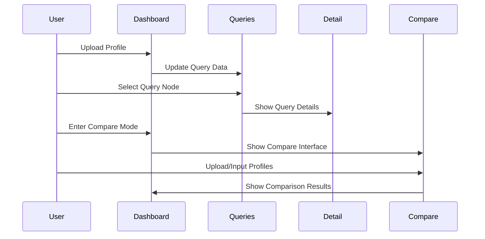

# Query Profiler Dashboard Design

## Dashboard Layout

### Main Dashboard View
```
+------------------------------------------------------------------+
|  Dashboard Header                                                 |
|  +----------------------------------------------------------+    |
|  |  Query Profiler Dashboard                    Search [🔍]  |    |
|  +----------------------------------------------------------+    |
|                                                                  |
|  +------------------+  +-----------------------------------+     |
|  |                  |  |                                   |     |
|  |  Profile Actions |  |  Shard Visualization             |     |
|  |  [Upload/Compare]|  |  (if multiple shards present)    |     |
|  |                  |  |                                   |     |
|  +------------------+  +-----------------------------------+     |
|                                                                  |
|  +------------------+  +-----------------------------------+     |
|  |                  |  |                                   |     |
|  |  Query Hierarchy |  |  Query Detail Panel              |     |
|  |  (ProfilerQueries)|  |  (QueryDetail)                  |     |
|  |                  |  |                                   |     |
|  |  - Searches Tab  |  |  - Operation Breakdown          |     |
|  |  - Aggregations  |  |  - Timing Metrics               |     |
|  |    Tab           |  |  - Collector Information        |     |
|  |                  |  |  - Performance Metrics          |     |
|  |                  |  |                                   |     |
|  +------------------+  +-----------------------------------+     |
|                                                                  |
+------------------------------------------------------------------+
```

### Comparison Mode View
```
+------------------------------------------------------------------+
|  Comparison Dashboard Header                                      |
|  +----------------------------------------------------------+    |
|  |  Profile Comparison Mode                      Search [🔍]  |    |
|  +----------------------------------------------------------+    |
|                                                                  |
|  +------------------+  +------------------+                      |
|  |                  |  |                  |                      |
|  |  Profile 1       |  |  Profile 2       |                      |
|  |  [Upload/JSON]   |  |  [Upload/JSON]   |                      |
|  |                  |  |                  |                      |
|  +------------------+  +------------------+                      |
|                                                                  |
|  +----------------------------------------------------------+    |
|  |  Comparison Results                                      |    |
|  |  (ProfilerComparisonResults)                            |    |
|  |                                                          |    |
|  |  - Execution Time Comparison                            |    |
|  |  - Query Structure Comparison                           |    |
|  |  - Result Differences                                   |    |
|  |                                                          |    |
|  +----------------------------------------------------------+    |
|                                                                  |
+------------------------------------------------------------------+
```

## Component Placement and Purpose

### 1. Main Dashboard Components

#### Header Section
- **Component**: ProfilerDashboard
- **Purpose**: 
  - Title display
  - Search functionality
  - Download options
  - Mode switching

#### Profile Actions Section
- **Component**: ProfilerDashboard
- **Purpose**:
  - Profile upload button
  - JSON input toggle
  - Comparison mode switch
  - Visualize button

#### Shard Visualization
- **Component**: ShardVisualization
- **Purpose**:
  - Visual representation of shards
  - Shard selection interface
  - Performance overview

#### Query Hierarchy Panel
- **Component**: ProfilerQueries
- **Purpose**:
  - Tree view of queries
  - Aggregation hierarchy
  - Node selection
  - Expandable/collapsible nodes

#### Query Detail Panel
- **Component**: QueryDetail
- **Purpose**:
  - Detailed query information
  - Performance metrics
  - Operation breakdown
  - Collector details

### 2. Comparison Mode Components

#### Profile Input Sections
- **Component**: ProfilerCompare
- **Purpose**:
  - File upload interface
  - JSON input areas
  - Validation feedback
  - Comparison type selection

#### Comparison Results
- **Component**: ProfilerComparisonResults
- **Purpose**:
  - Side-by-side comparison
  - Difference highlighting
  - Performance metrics
  - Structure comparison

## Component Interactions



## Responsive Design Considerations

### Desktop View (>1200px)
- Full two-panel layout
- Side-by-side comparison
- Expanded detail views

### Tablet View (768px-1200px)
- Collapsible panels
- Stacked comparison view
- Maintained functionality

### Mobile View (<768px)
- Single panel view
- Tabbed interface
- Simplified comparison

## Color Scheme and Visual Hierarchy

### Primary Colors
- Background: #FFFFFF
- Primary: #2563EB
- Secondary: #64748B
- Accent: #3B82F6

### Component-Specific Styling
- Query Hierarchy: Light gray background
- Detail Panel: White background
- Comparison View: Alternating backgrounds
- Interactive Elements: Primary color highlights

## Accessibility Considerations

### Keyboard Navigation
- Tab navigation between components
- Arrow keys for hierarchy navigation
- Enter/Space for selection

### Screen Reader Support
- ARIA labels for all interactive elements
- Descriptive alt text for visualizations
- Clear heading hierarchy

### Color Contrast
- WCAG 2.1 compliant contrast ratios
- Alternative indicators for color-coded information
- High contrast mode support 